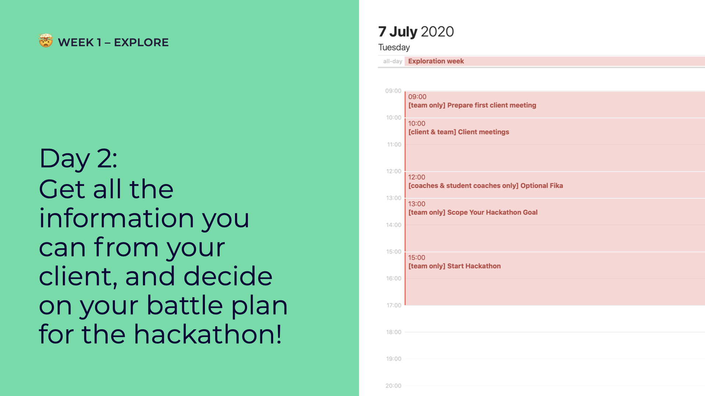

# Day 2: Meet the Client + Prepare for Hackathon

## **09:00** \[team only breakout\] Prepare first client meeting

Prepare for your first client meeting!

* Present your team members \(students and coaches\)
* Check if you understood all needs and goals \(you can reuse the pitch you made on day 1\)
* List all the questions you have
* Decide who does the talking
* Decide who takes notes

Some tips and tricks can come in handy if you've never attended a client meeting before!



## **10:00 or 11:00** \[client and team\] Client meetings

Depending on the team you are on, you will have a client meeting at 10:00 or 11:00.

We will send out e-mails up front!

If you need more meetings, you are free to book them with the team and client.

## 12:00 \[coaches & student coaches only\] Optional Fika

Talk about what's been going on your team; the good and the bad.



## 13:00 \[team only breakout\] Scope Your Hackathon Goal

### Why we do hackathons

We do hackathons at the start of osoc to...

* _...really_ get to know each other. It's your time to shine, show what you can do and see how your other team members can bring a project to the next level ✨
* ...run through a first _cycle_ together; from defining what you're going to build, to building, to delivering a first valuable _thing_, which you will define during the scoping session.
* ...make mistakes. Please make a lot of mistakes and learn, to do better in the next cycle 🔥

### What happens during a scoping session

Decide with the team what you want to create during the hackathon. This depends on your project, team members and goals! There's a [tutorial on how to do a scoping session](../../how-to-manage-a-team.md#how-to-do-a-scoping-session).

For example:

* Refine the story
* Create your wireframes/mockups
* A first prototype
* Try out a new technology
* ... Surprise us

Take the time you need, the team decides when they are to start hacking! 


Oh and remember the rule of **π** \([pi](https://twitter.com/pietercolpaert)\)... When doing an estimation of a task, let's say, for an hour, it's most likely to take about 3.14 times longer. Thank us later.


## 15:00 \[team only breakout\] Start Hackathon

Let's get started!

## 17:00 have a nice day 🥳

