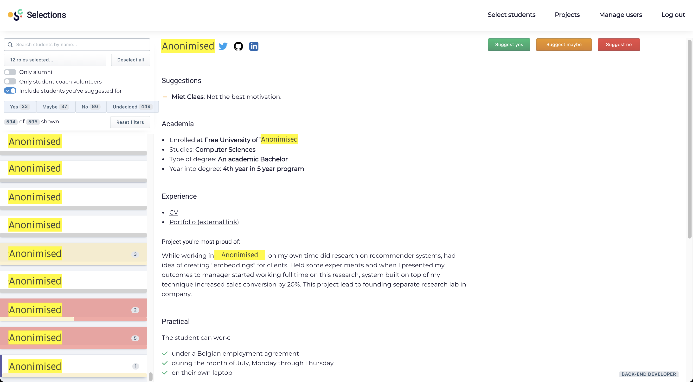
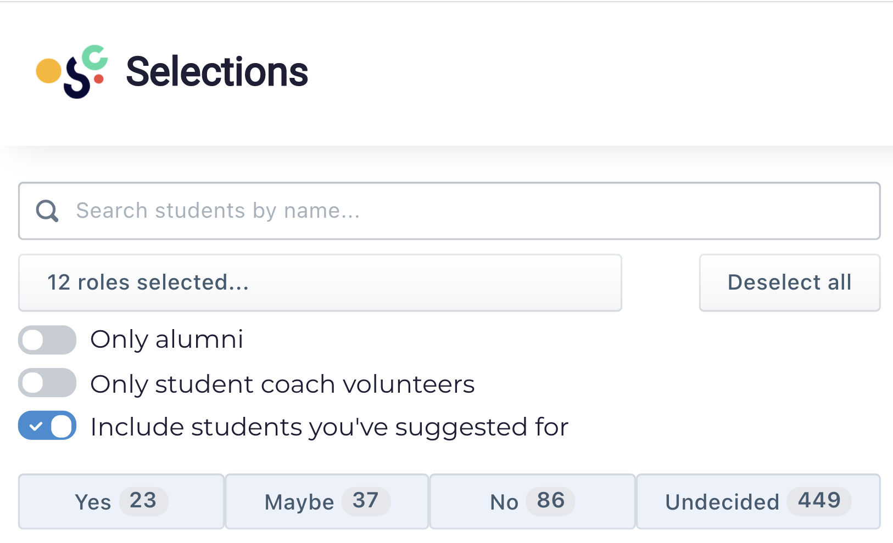
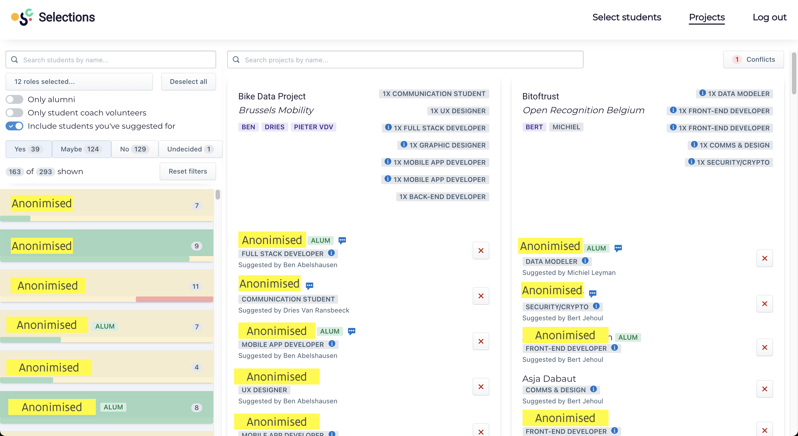
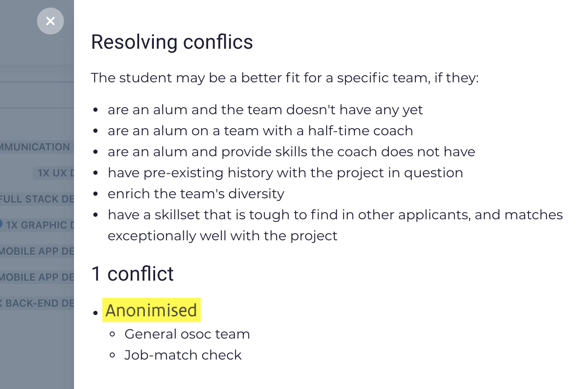

# Screening students

> I love bringing a project to life in collaboration with a group of people, that have different backgrounds.  
>   
> Eveline Vlassenroot

## What do we screen our students for?

### Filling out the Form

We expect students to take the time to fill out the form we created for them. The form is found on [https://osoc.be/students](https://osoc.be/students) – and opens from March until end of May.

Most important:

* Motivation
* CV
* Portfolio / github / a website / proof of what they did!

### Motivation

Someone that is eager and motivated to learn is good to have on your team – it bumps up the team morale! Coachable, hungry students grow _so_ fast.

The motivation letter usually reveals a big part; how fluent are they? What do they offer and hope to receive? Did they forget to replace the company name?

### Curriculum Vitae

#### Side projects

Side projects reveal a lot about someone's motivation; and if they have any prior work experience as well \(that wasn't mandatory as a school assignment\).

#### Education level

* First-year students
  * Usually students that are in year 1 of their education need some more time studying their craft to be part of osoc.
  * There is a real risk that they will fall behind and won't be able to help out a lot. This will drastically demotivate them and create tension in the team as well.
  * The occasional unicorn or people with relevant background do pop up. Their portfolio has to stand out _a lot_ to make up for the lack of experience in their work field \(side projects, working in teams, complex assignments in their work of field they are studying\).
* Second-year students
  * Make sure they succeeded their first year — zoom in on their portfolio, motivation and attitude. Some work that is not related to school is a huge plus.
* Third-year students
  * These students can take on some responsibility, which is nice. Zoom in on attitude and motivation! Their portfolio should be extended. Side projects where they had to deal with clients, group assignments and extra-curricular activities are a good sign of attitude and motivation.

### Proof in the Pudding

It's not enough just to have a motivation letter and a CV. We need proof of what they can do, and how they did it. Look for GitHub accounts, portfolio's, websites, ...

Can't find enough proof, but you see potential? Contact them and give them a call!

### Communication & Location

We need to be able to understand each other and work together.

#### Location

This means we unfortunately can't work together with people that live in other time zones for the remote edition, or with people that live too far away when it's an on-location edition. We expect students to be available to their clients, to be there when their teammates are and to be there when important announcements are made during live sessions.

We accept students for the remote edition from timezones that are a maximum of 2 hours apart, and if they can commit to being there when needed.

For editions that are on-location, we expect people from Belgium to participate, from the Netherlands or to find accommodation.

We also need to make sure we can actually pay students – this depends from country to country and needs to be reviewed case-by-case.

#### Language

Our main language is English; we need people to speak pretty well to make sure we can understand each other. We can't teach people how to speak English on the job unfortunately.

If their CV is not written in English \(even though it should have been, this is not a great sign\), or you're not sure how fluent they are; you can give that student a call. To find out if you can have a decent conversation with a student, ask them about their experience, motivation and why they want to join.

### Type of projects

This is a tricky one; but we look for students to fit the projects that we will have. In the first round we don't know how many projects will land and which type of projects we will have. So it's a wild guess. What we do know

* we need developers
* we need web- and application designers
* we need a communication team
* _sometimes_ we need marketing / business managers / pure graphic designers / ...
* a photographer/someone that can create videos during on-location editions
* a motion designer/someone that can create videos during remote editions

Keep an eye on creating well-rounded teams with different skill sets and backgrounds. A team with limited skills \(for example only developers or designers\), or a team that has the same mother tongue isn't great for the goals we have in mind: diverse teams that deliver projects for diverse people!

### I am not sure.. 🤔

If there's something else that's wrong, or if you're not sure, give them a call and ask some questions. Conduct the interview in English.

### Negotiating about money.

We do not negotiate their pay. It's not about money.

## Screening students with _The Selection Tool_

### Getting in

We have created a selection tool to make the process a bit easier: [selections.osoc.be](http://selections.osoc.be) 

To get access, connect with your Google account. _Yes, we want to get rid of this dependency too._

When you sign up, you'll get approved. You will not get an email \(we are working on this\) – if you cannot get access, get in touch!

### Overview

When you get in you will get an overview of all the students that applied. Click on a student to see what their application looked like.

[Based on the criteria](screening-students.md#what-do-we-screen-our-students-for), you can suggest **yes**, **maybe** or **no** for a student. To help other coaches in making their decision – and for us to be able to give a reason to the student, provide a reason!

### Searching & Filtering

To find students that are part of a certain field, you can use the role filters.

* You can quickly find alumni, students that applied as student coach or students you've suggested for.
* The students that had a definite yes, you can filter on as well.

## Assembling your team

After we've gone through selections, and we have some projects lined up, it's time to assemble your team.

_Make sure that your team is balanced. Match the right people with the right skills for the project, and make sure their characters will work._

### Criteria

We all aim for a healthy mix; on skill-level and on character type. It's important that teams are balanced:

* You can't have all unicorns in one team, nor can you have all inexperienced students in an other.
* It's also good to have some introverts and some extraverts in one team; leaders and followers. These types of teams motivate and complete each other in social skills.
* Try to have a healthy mix of skills, background and gender as much as possible as well.

This balance is hard to figure out beforehand — even if you gave those students a call and had an interview with them. It happens a team isn't working together as well as you thought it would. This could be an issue of skill, experience or character. If this is the case, reach out to the organisation/your fellow coaches and find out if there's other teams you can switch members with. This can be hard, but keep in mind it's about the whole of Osoc, not just about your team. It could happen one of your rockstars might be switched out with someone less experienced; but is a better fit for Osoc.

### How to assemble your team in the selection tool

Drag the student on the project that needs it. Only assign as many students as you need!

You cannot add a student to two teams. Resolve the issue with your fellow coach, to create healthy balanced teams! ♥️

